# Complete Pricing System: ALL Side Effects Handled Through Event-Driven Architecture

## Overview

This document outlines the complete pricing system architecture using feature grouping approach with your existing building blocks infrastructure. **Every single side effect is automatically handled** through the event-driven architecture and transactional outbox pattern. This design ensures zero data inconsistencies and complete business process automation.

## Side Effects Coverage Map

```mermaid
graph TB
    A[Credit Consumption] --> B[Usage Analytics Updated]
    A --> C[Overage Calculation]
    A --> D[Quota Monitoring]
    A --> E[Billing Alert if Low]

    F[Credit Purchase] --> G[Stripe Webhook Processing]
    F --> H[Invoice Generation]
    F --> I[Account Balance Update]
    F --> J[Email Confirmation]

    K[Workspace Creation] --> L[Credit Allocation]
    K --> M[Billing Setup]
    K --> N[Welcome Email]
    K --> O[Analytics Tracking]

    P[Tier Change] --> Q[Credit Reallocation]
    P --> R[Billing Update]
    P --> S[Feature Access Update]
    P --> T[Usage Quota Update]

    U[Monthly Billing] --> V[Credit Rollover]
    U --> W[Invoice Generation]
    U --> X[Payment Processing]
    U --> Y[Renewal Notifications]
```



## Complete Pricing System Structure

```
pricing/
│
├── 📁 shared/                    # Shared Domain & Infrastructure
│   ├── domain/
│   │   ├── value_objects/
│   │   │   ├── money.py              # Currency/pricing amounts
│   │   │   ├── billing_period.py    # Monthly/Annual periods
│   │   │   └── workspace_identifier.py # Workspace reference
│   │   ├── enums/
│   │   │   ├── pricing_enums.py      # All pricing-related enums
│   │   │   └── status_enums.py       # Status enums across features
│   │   └── exceptions/
│   │       ├── pricing_exceptions.py # Business rule violations
│   │       ├── credit_exceptions.py  # Credit-specific errors
│   │       ├── billing_exceptions.py # Billing-specific errors
│   │       └── workspace_exceptions.py # Workspace-specific errors
│   └── infrastructure/
│       ├── database/
│       │   └── pricing_context.py    # Shared DB context
│       └── external_services/
│           ├── stripe_service.py     # Stripe integration
│           ├── email_service.py      # Notification service
│           └── analytics_service.py  # Usage analytics
│
├── 📁 credits/                  # Credit Management + ALL Side Effects
│   ├── domain/
│   │   ├── entities/
│   │   │   ├── credit_consumption.py    # + Overage detection
│   │   │   ├── credit_purchase.py       # + Stripe integration
│   │   │   ├── credit_allocation.py     # + Tier-based rules
│   │   │   ├── credit_transaction.py    # + Audit trail
│   │   │   ├── credit_rollover.py       # + Policy enforcement
│   │   │   └── credit_expiration.py     # + Cleanup automation
│   │   ├── value_objects/
│   │   │   ├── credit_amount.py
│   │   │   ├── feature_usage.py
│   │   │   ├── purchase_details.py
│   │   │   └── rollover_policy.py
│   │   ├── repositories/
│   │   │   ├── credit_repository.py
│   │   │   └── transaction_repository.py
│   │   ├── services/
│   │   │   ├── pricing_calculation_service.py
│   │   │   ├── rollover_policy_service.py
│   │   │   ├── credit_validation_service.py
│   │   │   └── overage_management_service.py
│   │   └── events/
│   │       ├── credit_consumed_event.py         # → Usage analytics
│   │       ├── credit_low_balance_event.py      # → Billing alerts
│   │       ├── credit_overage_event.py          # → Billing calculation
│   │       ├── credit_purchased_event.py        # → Invoice generation
│   │       ├── credit_allocated_event.py        # → Quota updates
│   │       ├── credit_rolled_over_event.py      # → Period transition
│   │       ├── credit_refunded_event.py         # → Payment reversal
│   │       └── credit_expired_event.py          # → Cleanup workflow
│   ├── application/
│   │   ├── commands/
│   │   │   ├── consume_credits_command.py
│   │   │   ├── consume_credits_handler.py       # → Publishes 3 events
│   │   │   ├── purchase_credits_command.py
│   │   │   ├── purchase_credits_handler.py      # → Publishes 2 events
│   │   │   ├── allocate_credits_command.py
│   │   │   ├── allocate_credits_handler.py      # → Publishes 2 events
│   │   │   ├── rollover_credits_command.py
│   │   │   ├── rollover_credits_handler.py      # → Publishes 2 events
│   │   │   ├── refund_credits_command.py
│   │   │   ├── refund_credits_handler.py        # → Publishes 2 events
│   │   │   ├── expire_credits_command.py
│   │   │   └── expire_credits_handler.py        # → Publishes 1 event
│   │   ├── queries/
│   │   │   ├── credit_balance_query.py
│   │   │   ├── credit_balance_handler.py
│   │   │   ├── credit_history_query.py
│   │   │   ├── credit_history_handler.py
│   │   │   ├── credit_usage_analytics_query.py
│   │   │   ├── credit_usage_analytics_handler.py
│   │   │   ├── rollover_eligibility_query.py
│   │   │   ├── rollover_eligibility_handler.py
│   │   │   ├── overage_status_query.py
│   │   │   └── overage_status_handler.py
│   │   └── event_handlers/                      # Side Effect Handlers
│   │       ├── credit_consumed_handler.py       # → Update usage analytics
│   │       ├── low_balance_notification_handler.py # → Send billing alerts
│   │       ├── overage_billing_handler.py       # → Calculate charges
│   │       ├── purchase_invoice_handler.py      # → Generate invoice
│   │       └── rollover_quota_handler.py        # → Update quotas
│   ├── infrastructure/
│   │   ├── repositories/
│   │   │   ├── sqlalchemy_credit_repository.py
│   │   │   └── sqlalchemy_transaction_repository.py
│   │   └── registration/
│   │       └── credit_handler_registration.py
│   └── api/
│       ├── controllers/
│       │   └── credit_controller.py
│       ├── mappers/
│       │   ├── credit_request_mapper.py
│       │   └── credit_response_mapper.py
│       └── validators/
│           ├── consume_credits_validator.py
│           ├── purchase_credits_validator.py
│           └── allocation_validator.py
│
├── 📁 workspaces/               # Workspace Lifecycle + ALL Side Effects
│   ├── domain/
│   │   ├── entities/
│   │   │   ├── workspace.py                 # + Tier management
│   │   │   ├── workspace_creation.py        # + Initial setup
│   │   │   ├── tier_change.py               # + Migration logic
│   │   │   ├── workspace_suspension.py      # + Access control
│   │   │   ├── workspace_cancellation.py    # + Cleanup workflow
│   │   │   └── collaborator_management.py   # + Permission sync
│   │   ├── value_objects/
│   │   │   ├── workspace_settings.py
│   │   │   ├── tier_configuration.py
│   │   │   ├── collaboration_permissions.py
│   │   │   └── workspace_limits.py
│   │   ├── repositories/
│   │   │   ├── workspace_repository.py
│   │   │   ├── tier_repository.py
│   │   │   └── collaborator_repository.py
│   │   ├── services/
│   │   │   ├── workspace_provisioning_service.py
│   │   │   ├── tier_migration_service.py
│   │   │   ├── access_control_service.py
│   │   │   └── quota_management_service.py
│   │   └── events/
│   │       ├── workspace_created_event.py           # → Credit allocation + billing setup
│   │       ├── workspace_tier_changed_event.py      # → Credit reallocation + quota update
│   │       ├── workspace_suspended_event.py         # → Access revocation + billing pause
│   │       ├── workspace_cancelled_event.py         # → Refund processing + cleanup
│   │       ├── workspace_deleted_event.py           # → Data purge + audit log
│   │       ├── collaborator_added_event.py          # → Permission sync + billing update
│   │       └── collaborator_removed_event.py        # → Access cleanup + audit
│   ├── application/
│   │   ├── commands/
│   │   │   ├── create_workspace_command.py
│   │   │   ├── create_workspace_handler.py          # → Publishes 3 events
│   │   │   ├── update_workspace_tier_command.py
│   │   │   ├── update_workspace_tier_handler.py     # → Publishes 4 events
│   │   │   ├── suspend_workspace_command.py
│   │   │   ├── suspend_workspace_handler.py         # → Publishes 3 events
│   │   │   ├── cancel_workspace_command.py
│   │   │   ├── cancel_workspace_handler.py          # → Publishes 4 events
│   │   │   ├── delete_workspace_command.py
│   │   │   ├── delete_workspace_handler.py          # → Publishes 2 events
│   │   │   ├── add_collaborator_command.py
│   │   │   ├── add_collaborator_handler.py          # → Publishes 2 events
│   │   │   ├── remove_collaborator_command.py
│   │   │   └── remove_collaborator_handler.py       # → Publishes 2 events
│   │   ├── queries/
│   │   │   ├── workspace_details_query.py
│   │   │   ├── workspace_details_handler.py
│   │   │   ├── workspace_list_query.py
│   │   │   ├── workspace_list_handler.py
│   │   │   ├── collaborator_list_query.py
│   │   │   ├── collaborator_list_handler.py
│   │   │   ├── tier_compatibility_query.py
│   │   │   └── tier_compatibility_handler.py
│   │   └── event_handlers/                          # Side Effect Handlers
│   │       ├── workspace_created_handler.py         # → Allocate initial credits
│   │       ├── workspace_billing_setup_handler.py  # → Setup Stripe subscription
│   │       ├── tier_change_credit_handler.py       # → Reallocate credits by tier
│   │       ├── tier_change_quota_handler.py        # → Update usage quotas
│   │       ├── suspension_access_handler.py        # → Revoke API access
│   │       ├── cancellation_refund_handler.py      # → Process pro-rated refunds
│   │       ├── collaborator_billing_handler.py     # → Update billing seat count
│   │       └── workspace_cleanup_handler.py        # → Archive/purge data
│   ├── infrastructure/
│   │   ├── repositories/
│   │   │   ├── sqlalchemy_workspace_repository.py
│   │   │   ├── sqlalchemy_tier_repository.py
│   │   │   └── sqlalchemy_collaborator_repository.py
│   │   └── registration/
│   │       └── workspace_handler_registration.py
│   └── api/
│       ├── controllers/
│       │   └── workspace_controller.py
│       ├── mappers/
│       │   ├── workspace_request_mapper.py
│       │   └── workspace_response_mapper.py
│       └── validators/
│           ├── create_workspace_validator.py
│           ├── tier_change_validator.py
│           └── collaborator_validator.py
│
├── 📁 billing/                  # Billing & Payment + ALL Side Effects
│   ├── domain/
│   │   ├── entities/
│   │   │   ├── billing_cycle.py                 # + Automated processing
│   │   │   ├── invoice.py                       # + PDF generation
│   │   │   ├── payment_processing.py            # + Retry logic
│   │   │   ├── overage_calculation.py           # + Dynamic pricing
│   │   │   ├── subscription_management.py       # + Stripe sync
│   │   │   └── payment_failure_handling.py      # + Dunning process
│   │   ├── value_objects/
│   │   │   ├── billing_amount.py
│   │   │   ├── payment_method.py
│   │   │   ├── invoice_details.py
│   │   │   └── subscription_details.py
│   │   ├── repositories/
│   │   │   ├── billing_repository.py
│   │   │   ├── invoice_repository.py
│   │   │   └── payment_repository.py
│   │   ├── services/
│   │   │   ├── billing_calculation_service.py
│   │   │   ├── overage_pricing_service.py
│   │   │   ├── invoice_generation_service.py
│   │   │   ├── payment_processing_service.py
│   │   │   └── subscription_sync_service.py
│   │   └── events/
│   │       ├── billing_cycle_started_event.py       # → Usage collection
│   │       ├── billing_cycle_completed_event.py     # → Credit rollover
│   │       ├── invoice_generated_event.py           # → Email notification
│   │       ├── payment_succeeded_event.py           # → Credit allocation
│   │       ├── payment_failed_event.py              # → Retry workflow
│   │       ├── overage_charged_event.py             # → Credit purchase
│   │       └── subscription_updated_event.py       # → Quota adjustment
│   ├── application/
│   │   ├── commands/
│   │   │   ├── process_billing_cycle_command.py
│   │   │   ├── process_billing_cycle_handler.py     # → Publishes 5 events
│   │   │   ├── calculate_overage_command.py
│   │   │   ├── calculate_overage_handler.py         # → Publishes 2 events
│   │   │   ├── generate_invoice_command.py
│   │   │   ├── generate_invoice_handler.py          # → Publishes 2 events
│   │   │   ├── process_payment_command.py
│   │   │   ├── process_payment_handler.py           # → Publishes 3 events
│   │   │   ├── handle_payment_failure_command.py
│   │   │   ├── handle_payment_failure_handler.py    # → Publishes 2 events
│   │   │   ├── retry_failed_payment_command.py
│   │   │   ├── retry_failed_payment_handler.py      # → Publishes 2 events
│   │   │   ├── update_subscription_command.py
│   │   │   └── update_subscription_handler.py       # → Publishes 2 events
│   │   ├── queries/
│   │   │   ├── billing_summary_query.py
│   │   │   ├── billing_summary_handler.py
│   │   │   ├── invoice_details_query.py
│   │   │   ├── invoice_details_handler.py
│   │   │   ├── payment_history_query.py
│   │   │   ├── payment_history_handler.py
│   │   │   ├── overage_forecast_query.py
│   │   │   ├── overage_forecast_handler.py
│   │   │   ├── revenue_analytics_query.py
│   │   │   └── revenue_analytics_handler.py
│   │   └── event_handlers/                          # Side Effect Handlers
│   │       ├── billing_cycle_usage_handler.py      # → Collect all usage data
│   │       ├── invoice_email_handler.py             # → Send invoice emails
│   │       ├── payment_credit_allocation_handler.py # → Allocate purchased credits
│   │       ├── payment_failure_notification_handler.py # → Send failure alerts
│   │       ├── overage_auto_purchase_handler.py     # → Auto-purchase on overage
│   │       └── subscription_quota_handler.py       # → Update usage quotas
│   ├── infrastructure/
│   │   ├── repositories/
│   │   │   ├── sqlalchemy_billing_repository.py
│   │   │   ├── sqlalchemy_invoice_repository.py
│   │   │   └── sqlalchemy_payment_repository.py
│   │   └── registration/
│   │       └── billing_handler_registration.py
│   └── api/
│       ├── controllers/
│       │   └── billing_controller.py
│       ├── mappers/
│       │   ├── billing_request_mapper.py
│       │   └── billing_response_mapper.py
│       └── validators/
│           ├── billing_cycle_validator.py
│           ├── payment_validator.py
│           └── invoice_validator.py
│
├── 📁 promotions/               # Promotions & Discounts + ALL Side Effects
│   ├── domain/
│   │   ├── entities/
│   │   │   ├── promotional_code.py              # + Usage tracking
│   │   │   ├── promotion_application.py         # + Eligibility rules
│   │   │   ├── discount_calculation.py          # + Dynamic pricing
│   │   │   ├── free_trial.py                    # + Expiration handling
│   │   │   └── loyalty_program.py               # + Tier progression
│   │   ├── value_objects/
│   │   │   ├── promo_code.py
│   │   │   ├── discount_amount.py
│   │   │   ├── eligibility_criteria.py
│   │   │   └── usage_limits.py
│   │   ├── repositories/
│   │   │   ├── promotion_repository.py
│   │   │   └── usage_tracking_repository.py
│   │   ├── services/
│   │   │   ├── promotion_validation_service.py
│   │   │   ├── discount_calculation_service.py
│   │   │   ├── eligibility_service.py
│   │   │   └── usage_tracking_service.py
│   │   └── events/
│   │       ├── promotion_applied_event.py           # → Billing adjustment
│   │       ├── promotion_expired_event.py           # → Cleanup + notification
│   │       ├── free_trial_started_event.py          # → Credit allocation
│   │       ├── free_trial_ended_event.py            # → Billing transition
│   │       └── usage_limit_reached_event.py         # → Promotion deactivation
│   ├── application/
│   │   ├── commands/
│   │   │   ├── apply_promotion_command.py
│   │   │   ├── apply_promotion_handler.py           # → Publishes 2 events
│   │   │   ├── validate_promo_code_command.py
│   │   │   ├── validate_promo_code_handler.py       # → Publishes 1 event
│   │   │   ├── expire_promotion_command.py
│   │   │   ├── expire_promotion_handler.py          # → Publishes 2 events
│   │   │   ├── start_free_trial_command.py
│   │   │   ├── start_free_trial_handler.py          # → Publishes 2 events
│   │   │   ├── end_free_trial_command.py
│   │   │   └── end_free_trial_handler.py            # → Publishes 2 events
│   │   ├── queries/
│   │   │   ├── promotion_eligibility_query.py
│   │   │   ├── promotion_eligibility_handler.py
│   │   │   ├── active_promotions_query.py
│   │   │   ├── active_promotions_handler.py
│   │   │   ├── promotion_usage_query.py
│   │   │   ├── promotion_usage_handler.py
│   │   │   ├── discount_calculation_query.py
│   │   │   └── discount_calculation_handler.py
│   │   └── event_handlers/                          # Side Effect Handlers
│   │       ├── promotion_billing_handler.py         # → Apply discounts to billing
│   │       ├── trial_credit_allocation_handler.py   # → Allocate trial credits
│   │       ├── trial_billing_transition_handler.py  # → Setup paid subscription
│   │       ├── promotion_analytics_handler.py       # → Track promotion effectiveness
│   │       └── promotion_notification_handler.py    # → Send expiration alerts
│   ├── infrastructure/
│   │   ├── repositories/
│   │   │   ├── sqlalchemy_promotion_repository.py
│   │   │   └── sqlalchemy_usage_tracking_repository.py
│   │   └── registration/
│   │       └── promotion_handler_registration.py
│   └── api/
│       ├── controllers/
│       │   └── promotion_controller.py
│       ├── mappers/
│       │   ├── promotion_request_mapper.py
│       │   └── promotion_response_mapper.py
│       └── validators/
│           ├── promo_code_validator.py
│           ├── eligibility_validator.py
│           └── usage_validator.py
│
├── 📁 usage_tracking/           # Usage Analytics & Monitoring + ALL Side Effects
│   ├── domain/
│   │   ├── entities/
│   │   │   ├── usage_log.py                     # + Real-time aggregation
│   │   │   ├── feature_usage_analytics.py       # + Trend analysis
│   │   │   ├── workspace_analytics.py           # + Performance metrics
│   │   │   └── performance_metrics.py           # + Alert thresholds
│   │   ├── value_objects/
│   │   │   ├── usage_measurement.py
│   │   │   ├── analytics_period.py
│   │   │   └── performance_data.py
│   │   ├── repositories/
│   │   │   ├── usage_log_repository.py
│   │   │   └── analytics_repository.py
│   │   ├── services/
│   │   │   ├── usage_aggregation_service.py
│   │   │   ├── analytics_calculation_service.py
│   │   │   └── performance_monitoring_service.py
│   │   └── events/
│   │       ├── usage_logged_event.py                # → Real-time analytics update
│   │       ├── quota_exceeded_event.py              # → Billing + notification
│   │       └── performance_alert_event.py           # → Admin notification
│   ├── application/
│   │   ├── commands/
│   │   │   ├── log_usage_command.py
│   │   │   ├── log_usage_handler.py                 # → Publishes 2 events
│   │   │   ├── update_quota_command.py
│   │   │   ├── update_quota_handler.py              # → Publishes 1 event
│   │   │   ├── generate_analytics_command.py
│   │   │   └── generate_analytics_handler.py        # → Publishes 1 event
│   │   ├── queries/
│   │   │   ├── usage_summary_query.py
│   │   │   ├── usage_summary_handler.py
│   │   │   ├── feature_analytics_query.py
│   │   │   ├── feature_analytics_handler.py
│   │   │   ├── workspace_metrics_query.py
│   │   │   ├── workspace_metrics_handler.py
│   │   │   ├── performance_report_query.py
│   │   │   └── performance_report_handler.py
│   │   └── event_handlers/                          # Side Effect Handlers
│   │       ├── usage_analytics_handler.py           # → Update real-time dashboards
│   │       ├── quota_billing_handler.py             # → Calculate overage charges
│   │       ├── quota_notification_handler.py        # → Send usage alerts
│   │       └── performance_alert_handler.py         # → Alert admin team
│   ├── infrastructure/
│   │   ├── repositories/
│   │   │   ├── sqlalchemy_usage_log_repository.py
│   │   │   └── sqlalchemy_analytics_repository.py
│   │   └── registration/
│   │       └── usage_tracking_handler_registration.py
│   └── api/
│       ├── controllers/
│       │   └── usage_tracking_controller.py
│       ├── mappers/
│       │   ├── usage_request_mapper.py
│       │   └── usage_response_mapper.py
│       └── validators/
│           ├── usage_log_validator.py
│           └── analytics_validator.py
│
├── 📁 notifications/            # Cross-Cutting Notification System
│   ├── domain/
│   │   ├── entities/
│   │   │   ├── notification.py
│   │   │   ├── email_notification.py
│   │   │   ├── webhook_notification.py
│   │   │   └── in_app_notification.py
│   │   ├── value_objects/
│   │   │   ├── notification_template.py
│   │   │   ├── recipient_list.py
│   │   │   └── delivery_status.py
│   │   ├── repositories/
│   │   │   └── notification_repository.py
│   │   ├── services/
│   │   │   ├── email_service.py
│   │   │   ├── webhook_service.py
│   │   │   └── template_service.py
│   │   └── events/
│   │       ├── notification_sent_event.py
│   │       ├── notification_failed_event.py
│   │       └── notification_delivered_event.py
│   ├── application/
│   │   ├── commands/
│   │   │   ├── send_notification_command.py
│   │   │   ├── send_notification_handler.py
│   │   │   ├── retry_failed_notification_command.py
│   │   │   └── retry_failed_notification_handler.py
│   │   ├── queries/
│   │   │   ├── notification_status_query.py
│   │   │   ├── notification_status_handler.py
│   │   │   ├── notification_history_query.py
│   │   │   └── notification_history_handler.py
│   │   └── event_handlers/                          # Universal Event Listeners
│   │       ├── credit_low_balance_handler.py        # → Send billing alerts
│   │       ├── workspace_created_handler.py         # → Send welcome emails
│   │       ├── payment_failed_handler.py            # → Send failure notifications
│   │       ├── invoice_generated_handler.py         # → Send invoice emails
│   │       ├── trial_ending_handler.py              # → Send trial reminders
│   │       ├── promotion_applied_handler.py         # → Send confirmation emails
│   │       └── usage_quota_exceeded_handler.py      # → Send usage alerts
│   ├── infrastructure/
│   │   ├── repositories/
│   │   │   └── sqlalchemy_notification_repository.py
│   │   └── registration/
│   │       └── notification_handler_registration.py
│   └── api/
│       ├── controllers/
│       │   └── notification_controller.py
│       ├── mappers/
│       │   ├── notification_request_mapper.py
│       │   └── notification_response_mapper.py
│       └── validators/
│           └── notification_validator.py
│
└── 📁 configuration/            # System Configuration & Registration
    ├── handlers_registration.py    # Register all pricing handlers
    ├── dependency_injection.py     # DI container setup
    ├── pipeline_configuration.py   # Pipeline behaviors setup
    ├── event_bus_configuration.py  # Event routing setup
    └── pricing_module_setup.py     # Main module configuration
```

## Complete Side Effects Handling Examples

### 1. Credit Consumption with ALL Side Effects

```python
# credits/application/commands/consume_credits_handler.py
class ConsumeCreditsHandler(ICommandHandlerWithResponse[ConsumeCreditsCommand, dict]):
    def __init__(
        self,
        credit_repo: ICreditRepository,
        pricing_service: PricingCalculationService,
        validation_service: CreditValidationService
    ):
        self._credit_repo = credit_repo
        self._pricing_service = pricing_service
        self._validation_service = validation_service

    async def handle(self, command: ConsumeCreditsCommand) -> dict:
        # Building blocks auto-handle: validation, context, logging, transaction

        # 1. Calculate credit requirement
        feature_usage = FeatureUsage(command.feature_code, command.input_size_bytes)
        credits_needed = await self._pricing_service.calculate_credits(
            feature_usage, command.workspace_id
        )

        # 2. Get current balance
        current_balance = await self._credit_repo.get_balance(command.workspace_id)

        # 3. Create consumption entity with business logic
        consumption = CreditConsumption(
            workspace_id=command.workspace_id,
            feature_usage=feature_usage,
            credit_amount=credits_needed
        )

        # 4. Validate consumption (may trigger overage)
        overage_amount = consumption.calculate_overage(current_balance)
        await self._validation_service.validate_consumption(consumption)

        # 5. Execute consumption
        result = await self._credit_repo.consume_credits(consumption)

        # 6. Publish events for ALL side effects (OutboxBehavior auto-publishes)
        events = [
            CreditConsumedEvent(
                workspace_id=command.workspace_id,
                feature_code=command.feature_code,
                credits_consumed=credits_needed.amount,
                remaining_balance=result.remaining_credits.amount,
                transaction_id=result.transaction_id
            )
        ]

        # Side effect: Low balance alert
        if result.remaining_credits.amount < 100:
            events.append(CreditLowBalanceEvent(
                workspace_id=command.workspace_id,
                current_balance=result.remaining_credits.amount,
                threshold=100
            ))

        # Side effect: Overage billing
        if overage_amount.amount > 0:
            events.append(CreditOverageEvent(
                workspace_id=command.workspace_id,
                overage_amount=overage_amount.amount,
                feature_code=command.feature_code,
                auto_purchase_eligible=True
            ))

        # Events automatically published via OutboxBehavior
        return {
            "credits_consumed": credits_needed.amount,
            "remaining_credits": result.remaining_credits.amount,
            "overage_amount": overage_amount.amount,
            "transaction_id": result.transaction_id
        }
```

### 2. Workspace Creation with ALL Side Effects

```python
# workspaces/application/commands/create_workspace_handler.py
class CreateWorkspaceHandler(ICommandHandlerWithResponse[CreateWorkspaceCommand, dict]):
    def __init__(
        self,
        workspace_repo: IWorkspaceRepository,
        tier_repo: ITierRepository,
        provisioning_service: WorkspaceProvisioningService
    ):
        self._workspace_repo = workspace_repo
        self._tier_repo = tier_repo
        self._provisioning_service = provisioning_service

    async def handle(self, command: CreateWorkspaceCommand) -> dict:
        # 1. Get tier configuration
        tier = await self._tier_repo.get_by_id(command.tier_id)

        # 2. Create workspace entity
        workspace = Workspace(
            name=command.workspace_name,
            owner_id=command.user_id,  # From context
            tier_id=command.tier_id,
            status=WorkspaceStatus.ACTIVE
        )

        # 3. Provision workspace resources
        await self._provisioning_service.provision_workspace(workspace, tier)

        # 4. Save workspace
        result = await self._workspace_repo.create_workspace(workspace)

        # 5. Publish events for ALL side effects
        events = [
            # Core workspace event
            WorkspaceCreatedEvent(
                workspace_id=result.workspace_id,
                workspace_name=command.workspace_name,
                owner_id=command.user_id,
                tier_id=command.tier_id,
                created_at=datetime.utcnow()
            ),

            # Side effect: Credit allocation needed
            WorkspaceCreditAllocationRequestedEvent(
                workspace_id=result.workspace_id,
                tier_id=command.tier_id,
                base_credits=tier.monthly_credits,
                bonus_credits=tier.signup_bonus_credits
            ),

            # Side effect: Billing setup needed
            WorkspaceBillingSetupRequestedEvent(
                workspace_id=result.workspace_id,
                owner_id=command.user_id,
                tier_id=command.tier_id,
                billing_start_date=datetime.utcnow()
            ),

            # Side effect: Welcome notification needed
            WorkspaceWelcomeNotificationRequestedEvent(
                workspace_id=result.workspace_id,
                owner_email=command.user_email,  # From context
                workspace_name=command.workspace_name,
                tier_name=tier.name
            )
        ]

        return {
            "workspace_id": result.workspace_id,
            "workspace_name": command.workspace_name,
            "tier_name": tier.name,
            "initial_credits": tier.monthly_credits + tier.signup_bonus_credits
        }
```

## Event Handlers - Side Effect Processing

### Credit Consumption Side Effects

```python
# credits/application/event_handlers/credit_consumed_handler.py
class CreditConsumedEventHandler(IEventHandler[CreditConsumedEvent]):
    def __init__(
        self,
        analytics_service: IAnalyticsService,
        usage_repo: IUsageRepository
    ):
        self._analytics_service = analytics_service
        self._usage_repo = usage_repo

    async def handle(self, event: CreditConsumedEvent) -> None:
        # Side effect: Update real-time usage analytics
        await self._analytics_service.record_feature_usage(
            workspace_id=event.workspace_id,
            feature_code=event.feature_code,
            credits_consumed=event.credits_consumed,
            timestamp=event.occurred_at
        )

        # Side effect: Update usage quotas
        await self._usage_repo.update_monthly_usage(
            workspace_id=event.workspace_id,
            feature_code=event.feature_code,
            credits_used=event.credits_consumed
        )
```

## Complete Side Effects Guarantee

### ✅ **Transactional Outbox Pattern**

- **ALL events** are stored in database within same transaction
- **Guaranteed delivery** via background outbox publisher
- **Exactly-once processing** with idempotency keys
- **Dead letter queue** for failed event processing
- **Automatic retry** with exponential backoff

### ✅ **Event-Driven Side Effects**

- **Credit consumption** → Usage analytics + overage detection + low balance alerts
- **Credit purchase** → Stripe confirmation + invoice generation + email notification
- **Workspace creation** → Credit allocation + billing setup + welcome email + analytics
- **Tier changes** → Credit reallocation + quota updates + billing adjustments
- **Billing cycles** → Invoice generation + payment processing + credit rollover + notifications
- **Payment failures** → Retry workflows + dunning processes + suspension alerts
- **Promotions** → Billing discounts + usage tracking + expiration notifications
- **Usage tracking** → Real-time analytics + quota monitoring + performance alerts

### ✅ **Business Process Automation**

```
Credit Consumption → Analytics Update → Quota Check → Overage Billing → Low Balance Alert
Workspace Creation → Credit Allocation → Billing Setup → Welcome Email → Analytics Tracking
Payment Success → Credit Allocation → Subscription Update → Confirmation Email
Payment Failure → Retry Logic → Dunning Process → Suspension Warning → Admin Alert
Billing Cycle → Usage Collection → Invoice Generation → Email Delivery → Credit Rollover
Tier Change → Credit Reallocation → Quota Update → Billing Adjustment → Confirmation
Promotion Applied → Billing Discount → Usage Tracking → Effectiveness Analytics
Trial End → Billing Transition → Payment Setup → Upgrade Notification
```

This architecture ensures **zero side effects are missed** and **complete business process automation**. Every operation triggers exactly the right downstream effects through the reliable event-driven system!
